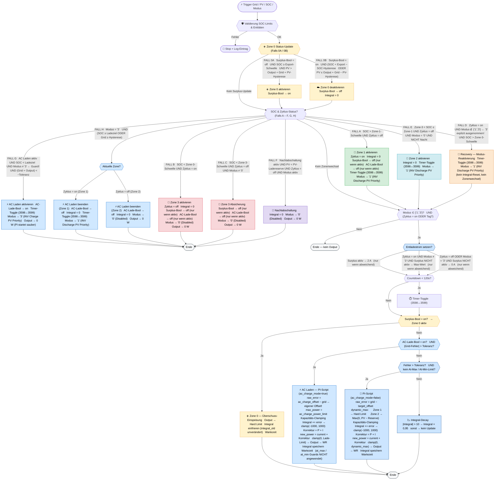

```mermaid
flowchart TD
    START([⚡ Trigger Grid / PV / SOC / Modus]) --> VAL

    VAL{{"🛡️ Validierung SOC-Limits & Entitäten"}}
    VAL -- Fehler --> STOP([🛑 Stop + Log-Eintrag])
    VAL -- OK --> SURPLUS_UPDATE

    %% ── Zone 0: Status-Update (vor Haupt-Logik) ─────────────────────────
    SURPLUS_UPDATE{{"☀️ Zone 0 Status-Update   (Falls 0A / 0B)"}}

    SURPLUS_UPDATE -- "FALL 0A   Surplus-Bool = off   UND SOC ≥ Export-Schwelle   UND PV > Output + Grid + PV-Hysterese" --> S0A
    S0A["☀️ Zone 0 aktivieren   Surplus-Bool → on"]

    SURPLUS_UPDATE -- "FALL 0B   Surplus-Bool = on   UND (SOC < Export − SOC-Hysterese   ODER PV ≤ Output + Grid − PV-Hysterese)" --> S0B
    S0B["☁️ Zone 0 deaktivieren   Surplus-Bool → off   Integral = 0"]

    SURPLUS_UPDATE -- "Kein Surplus-Update" --> ZONE_CHECK
    S0A --> ZONE_CHECK
    S0B --> ZONE_CHECK

    %% ── Haupt-Logik: Falls A – F (+ G, H) ───────────────────────────────
    ZONE_CHECK{{"SOC & Zyklus-Status?   (Falls A – F, G, H)"}}

    %% ── Fall A: Zone 1 ───────────────────────────────────────────────────
    ZONE_CHECK -- "FALL A   SOC > Zone-1-Schwelle UND Zyklus = off" --> Z1_START
    Z1_START["🔋 Zone 1 aktivieren   Zyklus = on   Integral = 0   Surplus-Bool → off (nur wenn aktiv)   AC-Lade-Bool → off (nur wenn aktiv)   Timer-Toggle (3598↔3599)   Modus → '1' (INV Discharge PV Priority)"]

    %% ── Fall B: Zone 3 (Zyklus on) ──────────────────────────────────────
    ZONE_CHECK -- "FALL B   SOC < Zone-3-Schwelle UND Zyklus = on" --> Z3_A
    Z3_A["🛑 Zone 3 aktivieren   Zyklus = off   Integral = 0   Surplus-Bool → off (nur wenn aktiv)   AC-Lade-Bool → off (nur wenn aktiv)   Modus → '0' (Disabled)   Output → 0 W"]

    %% ── Fall C: Zone 3 (Absicherung) ────────────────────────────────────
    ZONE_CHECK -- "FALL C   SOC < Zone-3-Schwelle UND Zyklus = off UND Modus ≠ '0'" --> Z3_B
    Z3_B["🛑 Zone 3 Absicherung   Surplus-Bool → off (nur wenn aktiv)   AC-Lade-Bool → off (nur wenn aktiv)   Modus → '0' (Disabled)   Output → 0 W"]

    %% ── Fall D: Recovery ─────────────────────────────────────────────────
    ZONE_CHECK -- "FALL D   Zyklus = on   UND Modus ∉ {'1','3'} ← '3' explizit ausgenommen!   UND SOC > Zone-3-Schwelle" --> RECOVERY
    RECOVERY["🔄 Recovery — Modus-Reaktivierung   Timer-Toggle (3598↔3599)   Modus → '1' (INV Discharge PV Priority)   (kein Integral-Reset, kein Zonenwechsel)"]

    %% ── Fall G: AC Laden Eintritt ────────────────────────────────────────
    ZONE_CHECK -- "FALL G   AC Laden aktiv   UND SOC < Ladeziel   UND Modus ≠ '3' ← Guard!   UND (Grid + Output) < −Toleranz" --> AC_START
    AC_START["⚡ AC Laden aktivieren   AC-Lade-Bool → on   Timer-Toggle (3598↔3599)   Modus → '3' (INV Charge PV Priority)   Output → 0 W (PI startet sauber)"]

    %% ── Fall H: AC Laden Beenden ─────────────────────────────────────────
    ZONE_CHECK -- "FALL H   Modus = '3'   UND (SOC ≥ Ladeziel ODER Grid ≥ Hysterese)" --> AC_END
    AC_END{{"Aktuelle Zone?"}}
    AC_END -- "Zyklus = on (Zone 1)" --> AC_END_Z1
    AC_END -- "Zyklus = off (Zone 2)" --> AC_END_Z2
    AC_END_Z1["⚡ AC Laden beenden (Zone 1)   AC-Lade-Bool → off   Integral = 0   Timer-Toggle (3598↔3599)   Modus → '1' (INV Discharge PV Priority)"]
    AC_END_Z2["⚡ AC Laden beenden (Zone 2)   AC-Lade-Bool → off   Integral = 0   Modus → '0' (Disabled)   Output → 0 W"]

    %% ── Fall E: Zone 2 ───────────────────────────────────────────────────
    ZONE_CHECK -- "FALL E   Zone-3 < SOC ≤ Zone-1 UND Zyklus = off UND Modus = '0' UND NICHT Nacht" --> Z2_START
    Z2_START["🔋 Zone 2 aktivieren   Integral = 0   Timer-Toggle (3598↔3599)   Modus → '1' (INV Discharge PV Priority)"]

    %% ── Fall F: Nachtabschaltung ─────────────────────────────────────────
    ZONE_CHECK -- "FALL F   Nachtabschaltung aktiv UND PV < PV-Ladereserve UND Zyklus = off UND Modus aktiv" --> NIGHT
    NIGHT["🌙 Nachtabschaltung   Integral = 0   Modus → '0' (Disabled)   Output → 0 W"]

    %% ── Kein Zonenwechsel ────────────────────────────────────────────────
    ZONE_CHECK -- "Kein Zonenwechsel" --> PI_GATE

    Z1_START --> PI_GATE
    Z2_START --> PI_GATE
    RECOVERY --> PI_GATE
    AC_START --> END_STOP([Ende])
    AC_END_Z1 --> END_STOP
    AC_END_Z2 --> END_STOP
    Z3_A --> END_STOP
    Z3_B --> END_STOP
    NIGHT --> END_STOP

    %% ── PI-Regler Gate ───────────────────────────────────────────────────
    PI_GATE{{"Modus ∈ {'1','3'}?   UND (Zyklus = on ODER Tag?)"}}
    PI_GATE -- Nein --> END_SKIP([Ende — kein Output])
    PI_GATE -- Ja --> DISCHARGE_SET

    %% ── Schritt 1: Entladestrom ──────────────────────────────────────────
    DISCHARGE_SET{{"Entladestrom setzen?"}}
    DISCHARGE_SET -- "Surplus aktiv → 2 A   (nur wenn abweichend)" --> TIMEOUT_CHECK
    DISCHARGE_SET -- "Zyklus = on UND Modus ≠ '3' UND Surplus NICHT aktiv → Max-Wert   (nur wenn abweichend)" --> TIMEOUT_CHECK
    DISCHARGE_SET -- "Zyklus = off ODER Modus = '3' UND Surplus NICHT aktiv → 0 A   (nur wenn abweichend)" --> TIMEOUT_CHECK

    %% ── Schritt 2: Timeout-Reset ─────────────────────────────────────────
    TIMEOUT_CHECK{{"Countdown < 120s?"}}
    TIMEOUT_CHECK -- Ja --> TIMEOUT_RESET["⏱️ Timer-Toggle (3598↔3599)"]
    TIMEOUT_CHECK -- Nein --> PI_DECISION
    TIMEOUT_RESET --> PI_DECISION

    %% ── Schritt 3: Output & Integral ─────────────────────────────────────
    PI_DECISION{{"Surplus-Bool = on?   → Zone 0 aktiv"}}
    PI_DECISION -- Ja --> CALC_SURPLUS
    PI_DECISION -- Nein --> AC_GATE

    %% ── Zone 0 Pfad ──────────────────────────────────────────────────────
    CALC_SURPLUS["☀️ Zone 0 — Überschuss-Einspeisung   Output → Hard Limit   Integral einfrieren (integral_old unverändert)   Wartezeit"]

    %% ── AC Laden Pfad ────────────────────────────────────────────────────
    AC_GATE{{"AC-Lade-Bool = on?   UND |Grid-Fehler| > Toleranz?"}}
    AC_GATE -- Ja --> CALC_AC
    AC_GATE -- Nein --> NORMAL_GATE

    CALC_AC["⚡ AC Laden — PI-Script (ac_charge_mode=true)   raw_error = ac_charge_offset − grid ← eigener Offset!   max_power = ac_charge_power_limit   Kapazitäts-Clamping   Integral += error → clamp(−1000, 1000)   Korrektur = P + I   new_power = current + Korrektur   clamp(0, Lade-Limit) → Output → WR   Integral speichern   Wartezeit   (at_max / at_min Guards NICHT angewendet)"]

    %% ── Normaler PI-Pfad ─────────────────────────────────────────────────
    NORMAL_GATE{{"Fehler > Toleranz?   UND kein At-Max / At-Min-Limit?"}}
    NORMAL_GATE -- Ja --> CALC_NORMAL
    NORMAL_GATE -- Nein --> INTEGRAL_DECAY

    CALC_NORMAL["🧠 PI-Script (ac_charge_mode=false)   raw_error = grid − target_offset   dynamic_max:      Zone 1 → Hard Limit      Zone 2 → Max(0, PV − Reserve)   Kapazitäts-Clamping   Integral += error → clamp(−1000, 1000)   Korrektur = P + I   new_power = current + Korrektur   clamp(0, dynamic_max) → Output → WR   Integral speichern   Wartezeit"]

    INTEGRAL_DECAY["📉 Integral-Decay   |Integral| > 10 → Integral × 0,95   sonst → kein Update"]

    CALC_SURPLUS --> END_OK([Ende])
    CALC_AC --> END_OK
    CALC_NORMAL --> END_OK
    INTEGRAL_DECAY --> END_OK

    %% ── Styles ───────────────────────────────────────────────────────────
    classDef zone0 fill:#fff3cd,stroke:#f0ad4e,color:#000
    classDef zone1 fill:#d4edda,stroke:#28a745,color:#000
    classDef zone2 fill:#d1ecf1,stroke:#17a2b8,color:#000
    classDef zone3 fill:#f8d7da,stroke:#dc3545,color:#000
    classDef night fill:#e2d9f3,stroke:#6f42c1,color:#000
    classDef recovery fill:#fde8d0,stroke:#e07b20,color:#000
    classDef accharge fill:#d0e8ff,stroke:#0066cc,color:#000
    classDef pi fill:#cce5ff,stroke:#004085,color:#000
    classDef end_node fill:#f8f9fa,stroke:#6c757d,color:#000

    class S0A,S0B,SURPLUS_UPDATE,CALC_SURPLUS,PI_DECISION zone0
    class Z1_START zone1
    class Z2_START zone2
    class Z3_A,Z3_B zone3
    class NIGHT night
    class RECOVERY recovery
    class AC_START,AC_END,AC_END_Z1,AC_END_Z2,AC_GATE,CALC_AC accharge
    class CALC_NORMAL,DISCHARGE_SET,INTEGRAL_DECAY,NORMAL_GATE pi
    class END_STOP,END_SKIP,END_OK end_node
```
