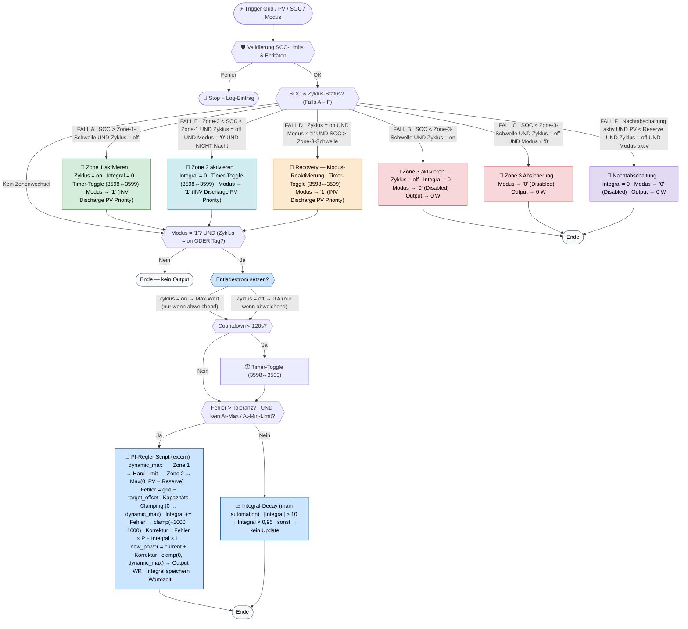

```mermaid
    flowchart TD
        START([⚡ Trigger Grid / PV / SOC / Modus]) --> VAL

        VAL{{"🛡️ Validierung SOC-Limits & Entitäten"}}
        VAL -- Fehler --> STOP([🛑 Stop + Log-Eintrag])
        VAL -- OK --> ZONE_CHECK

        ZONE_CHECK{{"SOC & Zyklus-Status? (Falls A – F)"}}

        %% ── Fall A: Zone 1 ───────────────────────────────────────────────────
        ZONE_CHECK -- "FALL A   SOC > Zone-1-Schwelle UND Zyklus = off" --> Z1_START
        Z1_START["🔋 Zone 1 aktivieren   Zyklus = on   Integral = 0   Timer-Toggle (3598↔3599)   Modus → '1' (INV Discharge PV Priority)"]

        %% ── Fall B: Zone 3 (Zyklus on) ──────────────────────────────────────
        ZONE_CHECK -- "FALL B   SOC < Zone-3-Schwelle UND Zyklus = on" --> Z3_A
        Z3_A["🛑 Zone 3 aktivieren   Zyklus = off   Integral = 0   Modus → '0' (Disabled)   Output → 0 W"]

        %% ── Fall C: Zone 3 (Absicherung) ────────────────────────────────────
        ZONE_CHECK -- "FALL C   SOC < Zone-3-Schwelle UND Zyklus = off UND Modus ≠ '0'" --> Z3_B
        Z3_B["🛑 Zone 3 Absicherung   Modus → '0' (Disabled)   Output → 0 W"]

        %% ── Fall D: Recovery ─────────────────────────────────────────────────
        ZONE_CHECK -- "FALL D   Zyklus = on UND Modus ≠ '1' UND SOC > Zone-3-Schwelle" --> RECOVERY
        RECOVERY["🔄 Recovery — Modus-Reaktivierung   Timer-Toggle (3598↔3599)   Modus → '1' (INV Discharge PV Priority)"]

        %% ── Fall E: Zone 2 ───────────────────────────────────────────────────
        ZONE_CHECK -- "FALL E   Zone-3 < SOC ≤ Zone-1 UND Zyklus = off UND Modus = '0' UND NICHT Nacht" --> Z2_START
        Z2_START["🔋 Zone 2 aktivieren   Integral = 0   Timer-Toggle (3598↔3599)   Modus → '1' (INV Discharge PV Priority)"]

        %% ── Fall F: Nachtabschaltung ──────────────────────────────────────────
        ZONE_CHECK -- "FALL F   Nachtabschaltung aktiv UND PV < Reserve UND Zyklus = off UND Modus aktiv" --> NIGHT
        NIGHT["🌙 Nachtabschaltung   Integral = 0   Modus → '0' (Disabled)   Output → 0 W"]

        %% ── Kein Zonenwechsel ────────────────────────────────────────────────
        ZONE_CHECK -- "Kein Zonenwechsel" --> PI_GATE

        Z1_START --> PI_GATE
        Z2_START --> PI_GATE
        RECOVERY --> PI_GATE
        Z3_A --> END_STOP([Ende])
        Z3_B --> END_STOP
        NIGHT --> END_STOP

        %% ── PI-Regler Gate ───────────────────────────────────────────────────
        PI_GATE{{"Modus = '1'? UND (Zyklus = on ODER Tag?)"}}
        PI_GATE -- Nein --> END_SKIP([Ende — kein Output])
        PI_GATE -- Ja --> DISCHARGE_SET

        %% ── Schritt 1: Entladestrom ──────────────────────────────────────────
        DISCHARGE_SET{{"Entladestrom setzen?"}}
        DISCHARGE_SET -- "Zyklus = on → Max-Wert (nur wenn abweichend)" --> TIMEOUT_CHECK
        DISCHARGE_SET -- "Zyklus = off → 0 A (nur wenn abweichend)" --> TIMEOUT_CHECK

        %% ── Schritt 2: Timeout-Reset ─────────────────────────────────────────
        TIMEOUT_CHECK{{"Countdown < 120s?"}}
        TIMEOUT_CHECK -- Ja --> TIMEOUT_RESET["⏱️ Timer-Toggle (3598↔3599)"]
        TIMEOUT_CHECK -- Nein --> PI_DECISION
        TIMEOUT_RESET --> PI_DECISION

        %% ── Schritt 3: PI-Regler ─────────────────────────────────────────────
        PI_DECISION{{"Fehler > Toleranz?   UND kein At-Max / At-Min-Limit?"}}
        PI_DECISION -- Ja --> CALC_NORMAL
        PI_DECISION -- Nein --> INTEGRAL_DECAY

        CALC_NORMAL["🧠 PI-Regler Script (extern)   dynamic_max:      Zone 1 → Hard Limit      Zone 2 → Max(0, PV − Reserve)   Fehler = grid − target_offset   Kapazitäts-Clamping (0 … dynamic_max)   Integral += Fehler → clamp(−1000, 1000)   Korrektur = Fehler × P + Integral × I   new_power = current + Korrektur   clamp(0, dynamic_max) → Output → WR   Integral speichern   Wartezeit"]

        INTEGRAL_DECAY["📉 Integral-Decay (main automation)   |Integral| > 10 → Integral × 0,95   sonst → kein Update"]

        CALC_NORMAL --> END_OK([Ende])
        INTEGRAL_DECAY --> END_OK

        %% ── Styles ───────────────────────────────────────────────────────────
        classDef zone1 fill:#d4edda,stroke:#28a745,color:#000
        classDef zone2 fill:#d1ecf1,stroke:#17a2b8,color:#000
        classDef zone3 fill:#f8d7da,stroke:#dc3545,color:#000
        classDef night fill:#e2d9f3,stroke:#6f42c1,color:#000
        classDef recovery fill:#fde8d0,stroke:#e07b20,color:#000
        classDef pi fill:#cce5ff,stroke:#004085,color:#000
        classDef end_node fill:#f8f9fa,stroke:#6c757d,color:#000

        class Z1_START zone1
        class Z2_START zone2
        class Z3_A,Z3_B zone3
        class NIGHT night
        class RECOVERY recovery
        class CALC_NORMAL,DISCHARGE_SET,INTEGRAL_DECAY pi
        class END_STOP,END_SKIP,END_OK end_node
```
