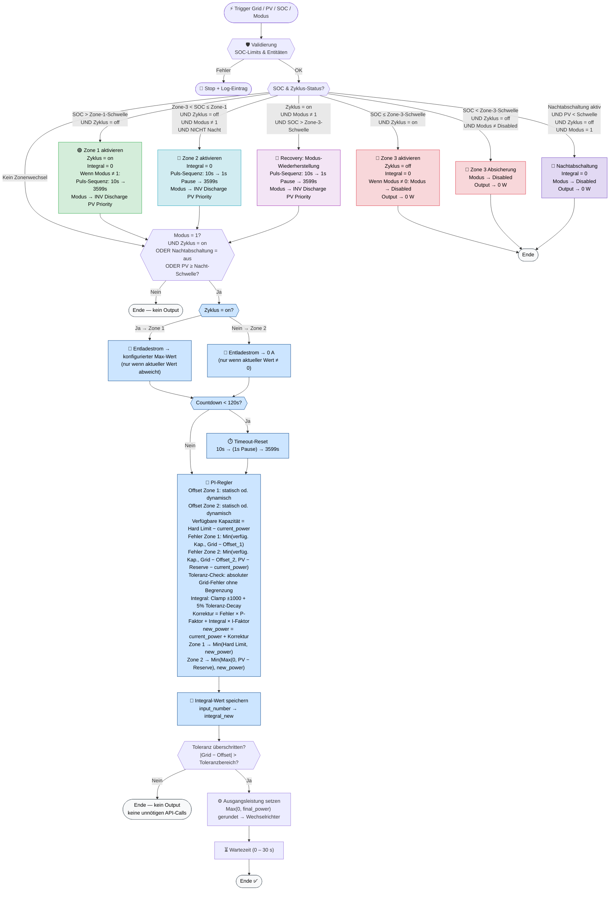

```mermaid
flowchart TD
    START([⚡ Trigger Grid / PV / SOC / Modus]) --> VAL

    VAL{{"🛡️ Validierung\nSOC-Limits & Entitäten"}}
    VAL -- Fehler --> STOP([🛑 Stop + Log-Eintrag])
    VAL -- OK --> ZONE_CHECK

    ZONE_CHECK{{"SOC & Zyklus-Status?"}}

    %% ── Zone 1 ──────────────────────────────────────────────────────────
    ZONE_CHECK -- "SOC > Zone-1-Schwelle\nUND Zyklus = off" --> Z1_START
    Z1_START["🟢 Zone 1 aktivieren\nZyklus = on\nIntegral = 0\nWenn Modus ≠ 1:\n  Puls-Sequenz: 10s → 3599s\nModus → INV Discharge PV Priority"]

    %% ── Zone 3 (Zyklus on) ──────────────────────────────────────────────
    ZONE_CHECK -- "SOC ≤ Zone-3-Schwelle\nUND Zyklus = on" --> Z3_A
    Z3_A["🛑 Zone 3 aktivieren\nZyklus = off\nIntegral = 0\nWenn Modus ≠ 0: Modus → Disabled\nOutput → 0 W"]

    %% ── Zone 3 (Absicherung) ────────────────────────────────────────────
    ZONE_CHECK -- "SOC < Zone-3-Schwelle\nUND Zyklus = off\nUND Modus ≠ Disabled" --> Z3_B
    Z3_B["🛑 Zone 3 Absicherung\nModus → Disabled\nOutput → 0 W"]

    %% ── Recovery ────────────────────────────────────────────────────────
    ZONE_CHECK -- "Zyklus = on\nUND Modus ≠ 1\nUND SOC > Zone-3-Schwelle" --> RECOVERY
    RECOVERY["🔄 Recovery: Modus-Wiederherstellung\nPuls-Sequenz: 10s → 1s Pause → 3599s\nModus → INV Discharge PV Priority"]

    %% ── Zone 2 ──────────────────────────────────────────────────────────
    ZONE_CHECK -- "Zone-3 < SOC ≤ Zone-1\nUND Zyklus = off\nUND Modus ≠ 1\nUND NICHT Nacht" --> Z2_START
    Z2_START["🔵 Zone 2 aktivieren\nIntegral = 0\nPuls-Sequenz: 10s → 1s Pause → 3599s\nModus → INV Discharge PV Priority"]

    %% ── Nachtabschaltung ────────────────────────────────────────────────
    ZONE_CHECK -- "Nachtabschaltung aktiv\nUND PV < Schwelle\nUND Zyklus = off\nUND Modus = 1" --> NIGHT
    NIGHT["🌙 Nachtabschaltung\nIntegral = 0\nModus → Disabled\nOutput → 0 W"]

    %% ── Kein Zonenwechsel ───────────────────────────────────────────────
    ZONE_CHECK -- "Kein Zonenwechsel" --> PI_GATE

    Z1_START --> PI_GATE
    Z2_START --> PI_GATE
    RECOVERY --> PI_GATE
    Z3_A --> END_STOP([Ende])
    Z3_B --> END_STOP
    NIGHT --> END_STOP

    %% ── PI-Regler Gate ──────────────────────────────────────────────────
    PI_GATE{{"Modus = 1?\nUND Zyklus = on\nODER Nachtabschaltung = aus\nODER PV ≥ Nacht-Schwelle?"}}
    PI_GATE -- Nein --> END_SKIP([Ende — kein Output])
    PI_GATE -- Ja --> DISCHARGE_SET

    %% ── Entladestrom setzen ─────────────────────────────────────────────
    DISCHARGE_SET{{"Zyklus = on?"}}
    DISCHARGE_SET -- "Ja → Zone 1" --> SET_MAX["🔋 Entladestrom → konfigurierter Max-Wert\n(nur wenn aktueller Wert abweicht)"]
    DISCHARGE_SET -- "Nein → Zone 2" --> SET_0A["🔋 Entladestrom → 0 A\n(nur wenn aktueller Wert ≠ 0)"]
    SET_MAX --> TIMEOUT_CHECK
    SET_0A --> TIMEOUT_CHECK

    %% ── Timeout ─────────────────────────────────────────────────────────
    TIMEOUT_CHECK{{"Countdown < 120s?"}}
    TIMEOUT_CHECK -- Ja --> TIMEOUT_RESET["⏱️ Timeout-Reset\n10s → (1s Pause) → 3599s"]
    TIMEOUT_CHECK -- Nein --> CALC
    TIMEOUT_RESET --> CALC

    %% ── PI-Regler Berechnung ────────────────────────────────────────────
    CALC["🧠 PI-Regler\nOffset Zone 1: statisch od. dynamisch\nOffset Zone 2: statisch od. dynamisch\nVerfügbare Kapazität = Hard Limit − current_power\nFehler Zone 1: Min(verfüg. Kap., Grid − Offset_1)\nFehler Zone 2: Min(verfüg. Kap., Grid − Offset_2, PV − Reserve − current_power)\nToleranz-Check: absoluter Grid-Fehler ohne Begrenzung\nIntegral: Clamp ±1000 + 5% Toleranz-Decay\nKorrektur = Fehler × P-Faktor + Integral × I-Faktor\nnew_power = current_power + Korrektur\nZone 1 → Min(Hard Limit, new_power)\nZone 2 → Min(Max(0, PV − Reserve), new_power)"]

    CALC --> INTEGRAL_SAVE["💾 Integral-Wert speichern\ninput_number → integral_new"]
    INTEGRAL_SAVE --> TOL_CHECK

    TOL_CHECK{{"Toleranz überschritten?\n|Grid − Offset| > Toleranzbereich?"}}
    TOL_CHECK -- Nein --> END_TOL([Ende — kein Output\nkeine unnötigen API-Calls])
    TOL_CHECK -- Ja --> SET_OUTPUT

    SET_OUTPUT["⚙️ Ausgangsleistung setzen\nMax(0, final_power) gerundet → Wechselrichter"]
    SET_OUTPUT --> WAIT["⏳ Wartezeit (0 – 30 s)"]
    WAIT --> END_OK([Ende ✅])

    %% ── Styles ──────────────────────────────────────────────────────────
    classDef zone1    fill:#d4edda,stroke:#28a745,color:#000
    classDef zone2    fill:#d1ecf1,stroke:#17a2b8,color:#000
    classDef zone3    fill:#f8d7da,stroke:#dc3545,color:#000
    classDef night    fill:#e2d9f3,stroke:#6f42c1,color:#000
    classDef recovery fill:#f3e5f5,stroke:#9c27b0,color:#000
    classDef pi       fill:#cce5ff,stroke:#004085,color:#000
    classDef end_node fill:#f8f9fa,stroke:#6c757d,color:#000

    class Z1_START zone1
    class Z2_START zone2
    class Z3_A,Z3_B zone3
    class NIGHT night
    class RECOVERY recovery
    class CALC,DISCHARGE_SET,SET_MAX,SET_0A,TIMEOUT_CHECK,TIMEOUT_RESET,INTEGRAL_SAVE pi
    class END_STOP,END_SKIP,END_TOL,END_OK end_node
```
