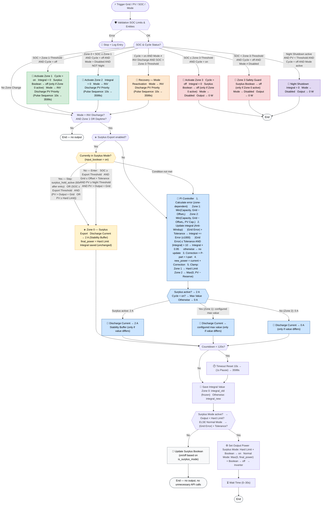

```mermaid
    flowchart TD
        START([⚡ Trigger Grid / PV / SOC / Mode]) --> VAL

        VAL{{"🛡️ Validation SOC Limits & Entities"}}
        VAL -- Error --> STOP([🛑 Stop + Log Entry])
        VAL -- OK --> ZONE_CHECK

        ZONE_CHECK{{"SOC & Cycle Status?"}}

        %% ── Zone 1 ──────────────────────────────────────────────────
        ZONE_CHECK -- "SOC > Zone-1-Threshold AND Cycle = off" --> Z1_START
        Z1_START["🔋 Activate Zone 1   Cycle = on   Integral = 0   Surplus Boolean → off (only if Zone 0 active)   Mode → INV Discharge PV Priority   (Pulse Sequence: 10s → 3599s)"]

        %% ── Zone 3 (Cycle on) ──────────────────────────────────────
        ZONE_CHECK -- "SOC ≤ Zone-3-Threshold AND Cycle = on" --> Z3_A
        Z3_A["🛑 Activate Zone 3   Cycle = off   Integral = 0   Surplus Boolean → off (only if Zone 0 active)   Mode → Disabled   Output → 0 W"]

        %% ── Zone 3 (Safety) ────────────────────────────────────────
        ZONE_CHECK -- "SOC < Zone-3-Threshold AND Cycle = off AND Mode ≠ Disabled" --> Z3_B
        Z3_B["🛑 Zone 3 Safety Guard   Surplus Boolean → off (only if Zone 0 active)   Mode → Disabled   Output → 0 W"]

        %% ── Recovery ────────────────────────────────────────────────
        ZONE_CHECK -- "Cycle = on AND Mode ≠ INV Discharge AND SOC > Zone-3-Threshold" --> RECOVERY
        RECOVERY["🔄 Recovery — Mode Reactivation   Mode → INV Discharge PV Priority   (Pulse Sequence: 10s → 3599s)"]

        %% ── Zone 2 ──────────────────────────────────────────────────
        ZONE_CHECK -- "Zone-3 < SOC ≤ Zone-1 AND Cycle = off AND Mode = Disabled AND NOT Night" --> Z2_START
        Z2_START["🔋 Activate Zone 2   Integral = 0   Mode → INV Discharge PV Priority   (Pulse Sequence: 10s → 3599s)"]

        %% ── Night Shutdown ────────────────────────────────────────
        ZONE_CHECK -- "Night Shutdown active AND PV < Threshold AND Cycle = off AND Mode active" --> NIGHT
        NIGHT["🌙 Night Shutdown   Integral = 0   Mode → Disabled   Output → 0 W"]

        %% ── No Zone Change ───────────────────────────────────────
        ZONE_CHECK -- "No Zone Change" --> PI_GATE

        Z1_START --> PI_GATE
        Z2_START --> PI_GATE
        RECOVERY --> PI_GATE
        Z3_A --> END_STOP([End])
        Z3_B --> END_STOP
        NIGHT --> END_STOP

        %% ── PI Controller Gate ──────────────────────────────────────
        PI_GATE{{"Mode = INV Discharge? AND Zone 1 OR Daytime?"}}
        PI_GATE -- No --> END_SKIP([End — no output])
        PI_GATE -- Yes --> SURPLUS_CHECK

        %% ── Surplus Check ──────────────────────────────────────────
        SURPLUS_CHECK{{"☀️ Surplus Export enabled?"}}
        SURPLUS_CHECK -- No --> CALC_NORMAL
        SURPLUS_CHECK -- Yes --> SURPLUS_STATE

        %% ── Surplus Two-State Logic ─────────────────────────────────
        SURPLUS_STATE{{"Currently in Surplus Mode?   (input_boolean = on)"}}
        SURPLUS_STATE -- "Yes — Stay:   surplus_hold_active (60s after entry)   OR (SOC ≥ Export Threshold   AND (PV > Output + Grid   OR PV ≥ Hard Limit))" --> CALC_SURPLUS
        SURPLUS_STATE -- "No — Enter:   SOC ≥ Export Threshold   AND Grid ≤ Offset + Tolerance   AND PV ≥ Night Threshold   AND PV > Output + Grid" --> CALC_SURPLUS
        SURPLUS_STATE -- "Condition not met" --> CALC_NORMAL

        %% ── Zone 0 Path ─────────────────────────────────────────────
        CALC_SURPLUS["☀️ Zone 0 — Surplus Export   Discharge Current → 2 A (Stability Buffer)   final_power = Hard Limit   Integral saved (unchanged)"]
        CALC_SURPLUS --> TIMEOUT_CHECK

        %% ── Normal PI Path ────────────────────────────────────────
        CALC_NORMAL["🧠 PI Controller   1. Calculate error (zone-dependent)      Zone 1: Min(Capacity, Grid − Offset₁)      Zone 2: Min(Capacity, Grid − Offset₂, PV Cap.)   2. Update integral (Anti-Windup)      |Grid Error| > Tolerance → Integral += Error (±1000)      |Grid Error| ≤ Tolerance AND |Integral| > 10 → Integral × 0.95      otherwise → no update   3. Correction = P-part + I-part   4. new_power = current + Correction   5. Clamp:      Zone 1 → Hard Limit      Zone 2 → Max(0, PV − Reserve)"]
        CALC_NORMAL --> DISCHARGE_SET

        %% ── Set Discharge Current ─────────────────────────────────
        DISCHARGE_SET{{"Surplus active? → 2 A   Cycle = on? → Max Value   Otherwise → 0 A"}}
        DISCHARGE_SET -- "Surplus active: 2 A" --> SET_2A["🔋 Discharge Current → 2 A Stability Buffer (only if value differs)"]
        DISCHARGE_SET -- "Yes (Zone 1): configured max value" --> SET_40A["🔋 Discharge Current → configured max value (only if value differs)"]
        DISCHARGE_SET -- "No (Zone 2): 0 A" --> SET_0A["🔋 Discharge Current → 0 A (only if value differs)"]
        SET_2A --> TIMEOUT_CHECK
        SET_40A --> TIMEOUT_CHECK
        SET_0A --> TIMEOUT_CHECK

        %% ── Timeout ─────────────────────────────────────────────────
        TIMEOUT_CHECK{{"Countdown < 120s?"}}
        TIMEOUT_CHECK -- Yes --> TIMEOUT_RESET["⏱️ Timeout Reset 10s → (1s Pause) → 3599s"]
        TIMEOUT_CHECK -- No --> INTEGRAL_SAVE
        TIMEOUT_RESET --> INTEGRAL_SAVE

        %% ── Integral & Output ───────────────────────────────────────
        INTEGRAL_SAVE["💾 Save Integral Value   Zone 0: integral_old (frozen)   Otherwise: integral_new"]
        INTEGRAL_SAVE --> TOL_CHECK

        TOL_CHECK{{"Surplus Mode active?   → Output < Hard Limit?   ELSE Normal Mode   → |Grid Error| > Tolerance?"}}
        TOL_CHECK -- No --> BOOL_UPDATE["🔁 Update Surplus Boolean   (on/off based on is_surplus_mode)"]
        BOOL_UPDATE --> END_TOL([End — no output, no unnecessary API calls])
        TOL_CHECK -- Yes --> SET_OUTPUT

        SET_OUTPUT["⚙️ Set Output Power   Surplus Mode: Hard Limit + Boolean → on   Normal Mode: Max(0, final_power) + Boolean → off   → Inverter"]
        SET_OUTPUT --> WAIT["⏳ Wait Time (0–30s)"]
        WAIT --> END_OK([End])

        %% ── Styles ──────────────────────────────────────────────────
        classDef zone0 fill:#fff3cd,stroke:#f0ad4e,color:#000
        classDef zone1 fill:#d4edda,stroke:#28a745,color:#000
        classDef zone2 fill:#d1ecf1,stroke:#17a2b8,color:#000
        classDef zone3 fill:#f8d7da,stroke:#dc3545,color:#000
        classDef night fill:#e2d9f3,stroke:#6f42c1,color:#000
        classDef recovery fill:#fde8d0,stroke:#e07b20,color:#000
        classDef pi fill:#cce5ff,stroke:#004085,color:#000
        classDef end_node fill:#f8f9fa,stroke:#6c757d,color:#000

        class CALC_SURPLUS,SURPLUS_STATE zone0
        class Z1_START zone1
        class Z2_START zone2
        class Z3_A,Z3_B zone3
        class NIGHT night
        class RECOVERY recovery
        class CALC_NORMAL,DISCHARGE_SET,SET_40A,SET_0A,SET_2A pi
        class END_STOP,END_SKIP,END_TOL,END_OK,BOOL_UPDATE end_node
```
